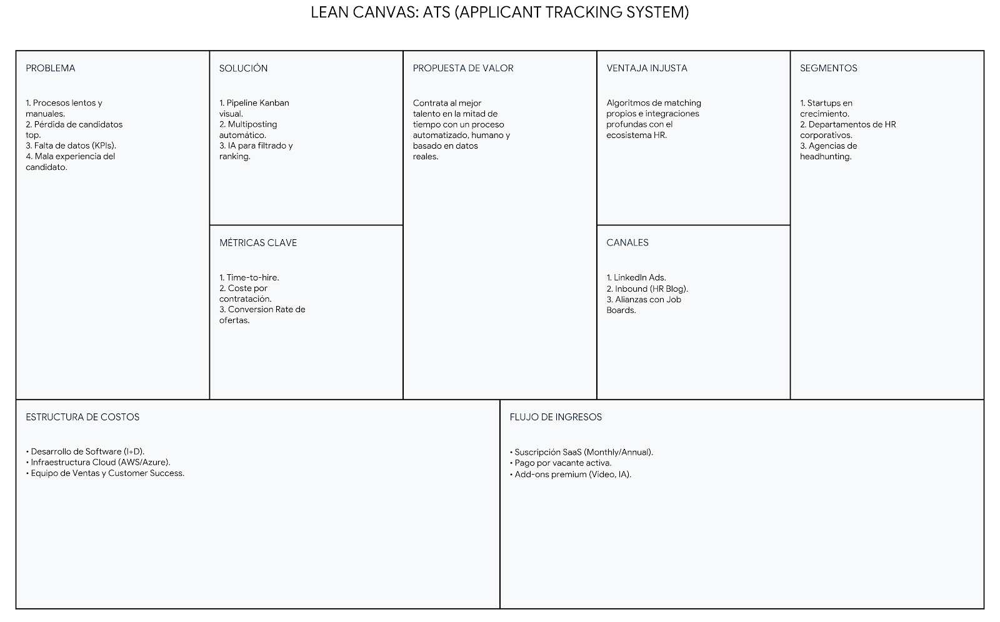
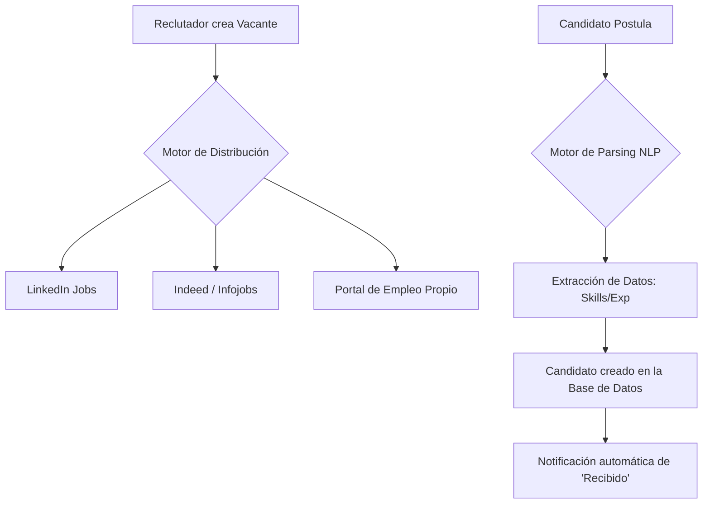
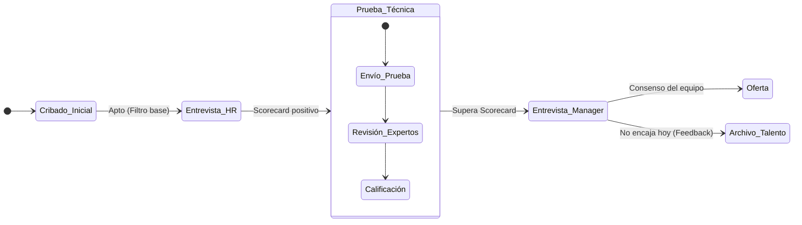
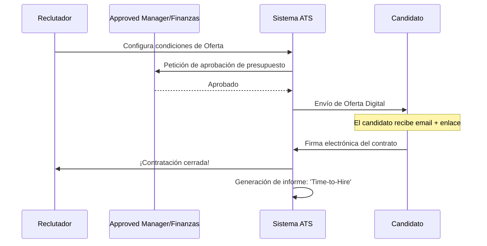
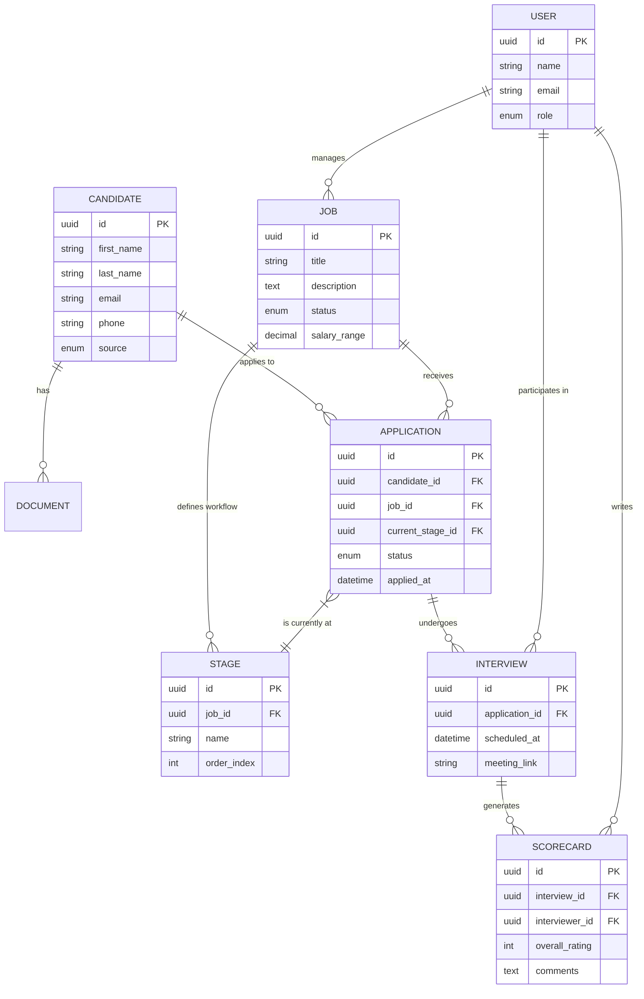
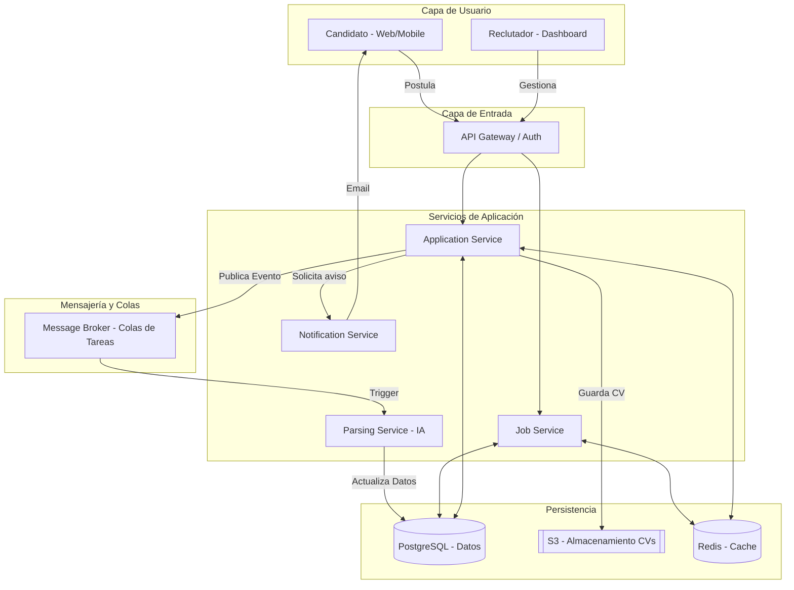
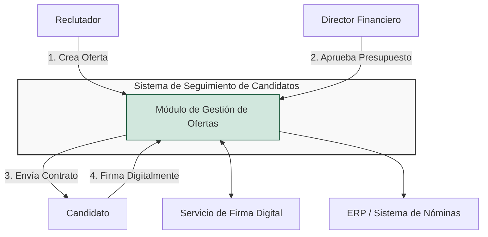
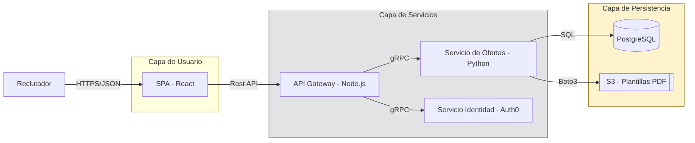
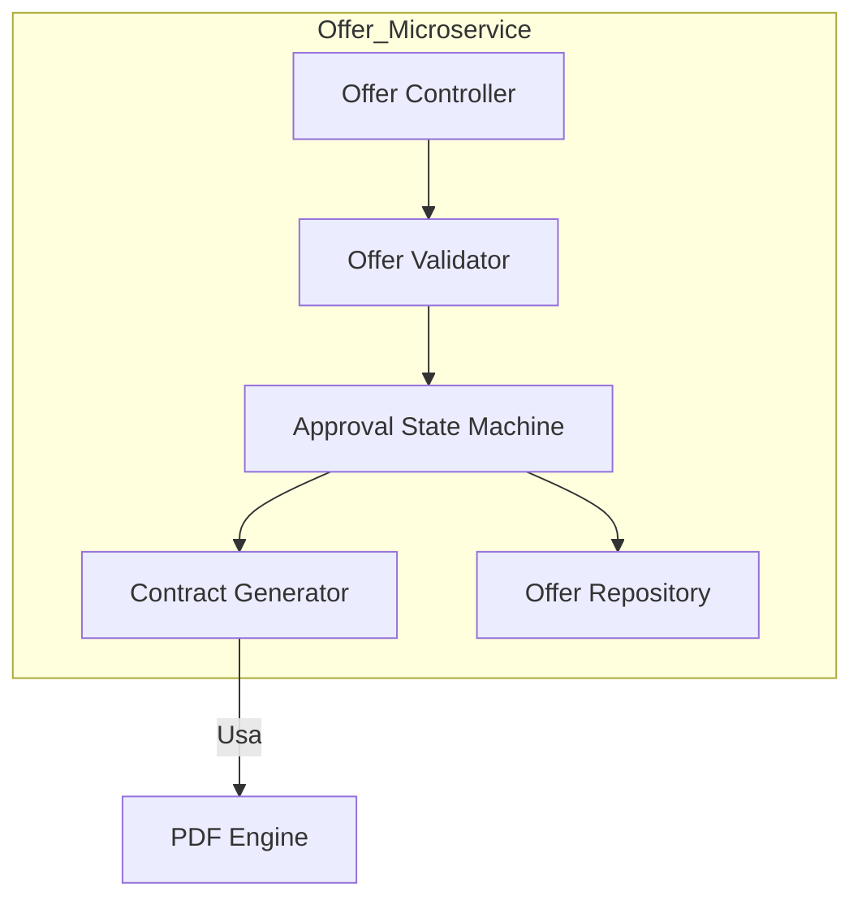
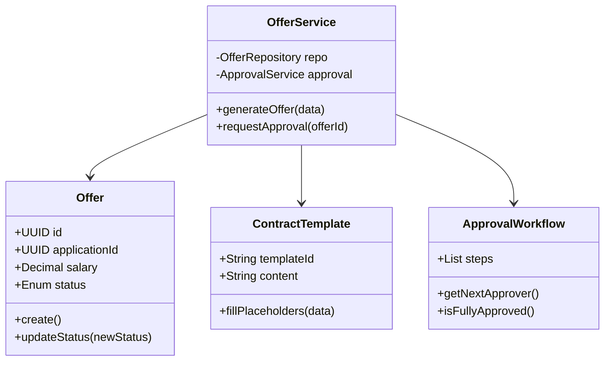

# Diseño de un sistema de gestión de candidatos

## Descripción, valor añadido y ventajas competitivas

### 1. Funcionalidades básicas (de mayor a menor prioridad)

Si estás construyendo o comprando un ATS, este es el orden de importancia para que el sistema sea funcional y genere valor inmediato:

1.  **Gestión centralizada de candidatos (Base de Datos):** El "corazón". Poder almacenar, buscar y filtrar perfiles en un solo lugar. Sin esto, no tienes nada.
2.  **Pipeline de reclutamiento (Workflow):** Un tablero visual (tipo Kanban) que permita ver en qué etapa está cada candidato (Entrevista, Prueba técnica, Oferta).
3.  **Multiposting:** Capacidad de publicar una vacante en múltiples portales de empleo (LinkedIn, Indeed, portales locales) con un solo clic.
4.  **Parsing de CVs:** Extracción automática de datos de un PDF para completar el perfil del candidato sin que el reclutador tenga que copiar y pegar.
5.  **Herramientas de colaboración:** Notas compartidas, menciones (@usuario) y sistema de calificación (estrellas o scorecards) para que los *hiring managers* opinen.
6.  **Automatización de comunicaciones:** Plantillas de correo que se envían solas cuando un candidato cambia de etapa (especialmente el temido pero necesario correo de rechazo).
7.  **Reporting y Analytics:** Métricas clave como el "Time-to-Hire" o la efectividad de las fuentes de reclutamiento.

---

### 2. Ventajas Competitivas de usar un ATS

Implementar un sistema de estos no es solo un gasto, es una ventaja estratégica por:

* **Velocidad de contratación:** Reduces el tiempo operativo en tareas manuales, permitiendo cerrar vacantes antes que tu competencia se lleve al talento.
* **Employer Branding:** Una comunicación fluida y rápida da una imagen de profesionalidad que atrae a mejores candidatos.
* **Cumplimiento Legal (GDPR):** Gestionar datos sensibles en Excel es un riesgo. Un ATS asegura que los datos se traten según la normativa de privacidad.
* **Reducción del Coste por Contratación:** Al saber qué portales funcionan mejor, dejas de gastar dinero en anuncios que no traen candidatos de calidad.

---

### 3. Funciones Principales del Sistema
Podemos resumir la esencia del ATS en cuatro pilares:

* **Sourcing (Captación):** Atraer el talento de forma pasiva y activa.
* **Tracking (Seguimiento):** Saber exactamente dónde está cada persona en el proceso y evitar que los candidatos "se enfríen".
* **Evaluación:** Centralizar las pruebas, entrevistas y feedback para tomar decisiones basadas en datos, no en "sensaciones".
* **Onboarding inicial:** Facilitar la transición del candidato seleccionado hacia su primer día en la empresa.

---

### 4. Lean Canvas del Modelo de Negocio (SaaS ATS)

## Descripción de los 3 casos de uso principales

### 1. Sourcing Inteligente y Publicación Omnicanal
Este caso de uso se centra en la **captación**. El problema que resuelve es la dispersión: sin un ATS, el reclutador tiene que entrar en LinkedIn, Indeed y portales locales uno por uno, y luego descargar los CVs manualmente.

* **Publicación en un clic:** Creas la vacante una vez y el sistema la "empuja" a todos los portales configurados.
* **Parsing (Procesamiento de Lenguaje Natural):** El sistema lee el CV del candidato y rellena automáticamente los campos (experiencia, educación, habilidades) para que puedas filtrar por "Java" o "Madrid" sin abrir el PDF.
* **Página de Empleo (Career Page):** Genera automáticamente una web corporativa atractiva donde los candidatos pueden postular directamente, mejorando la marca empleadora.

---

### 2. Gestión del Pipeline y Evaluación Colaborativa
Este es el "día a día" del reclutador y el *Hiring Manager* (el jefe que busca para su equipo). El objetivo es que la información sea **transparente y centralizada**.

* **Scorecards (Tarjetas de puntuación):** En lugar de decir "me cayó bien", el evaluador puntúa competencias específicas (ej. "Capacidad analítica: 4/5").
* **Sincronización de Calendarios:** El ATS se conecta con Google o Outlook para agendar entrevistas sin salir de la plataforma, enviando automáticamente el enlace de Zoom o Teams.
* **Menciones y Notas:** El equipo puede dejar comentarios internos (@ana, este perfil me encanta para el equipo técnico) que el candidato nunca ve.

---

### 3. Oferta, Cierre y Analítica de Proceso
El último paso es el más crítico: convertir un candidato interesado en un empleado contratado. El ATS aquí actúa como una herramienta de **ventas y legal**.

* **Workflow de Aprobación de Oferta:** Antes de enviar el contrato, el sistema pide aprobación al Director Financiero y al Manager para validar el salario.
* **Firma Electrónica:** Integración con herramientas como DocuSign para que el candidato firme su contrato desde el móvil.
* **Reporting (El "Por qué"):** El sistema genera informes sobre el **Time-to-Hire** (¿cuánto tardamos en contratar?) y el **Source of Hire** (¿de dónde vienen nuestros mejores empleados?).

---

#### ¿Cuál es la mayor ventaja competitiva aquí?
Sin duda, la **Experiencia del Candidato**. En un mercado donde el talento escasea, el ATS permite dar feedback rápido. Un candidato que recibe una respuesta (aunque sea negativa) en 3 días tiene una imagen mucho mejor de tu empresa que uno que espera 3 semanas en el silencio absoluto.

## Modelo de datos

Para construir un ATS que no se rompa al primer cambio de escala, necesitamos un modelo de datos relacional sólido. No se trata solo de guardar nombres, sino de trazar la **trazabilidad completa** de un candidato a través de distintas vacantes y procesos.

Aquí tienes la propuesta técnica detallada del modelo de datos.

---

## Entidades y Atributos

### 1. Gestión de Talento (Candidates & Documents)
Es el núcleo de información personal. Un candidato puede existir en la base de datos sin estar necesariamente aplicando a una vacante activa (Talent Pool).

| Entidad | Atributo | Tipo de Dato | Descripción |
| :--- | :--- | :--- | :--- |
| **Candidate** | `id` | UUID (PK) | Identificador único. |
| | `first_name` | String | Nombre del candidato. |
| | `last_name` | String | Apellidos. |
| | `email` | String (Unique) | Correo electrónico principal. |
| | `phone` | String | Teléfono de contacto. |
| | `linkedin_url` | String | Enlace al perfil profesional. |
| | `source` | Enum | Origen (LinkedIn, Referido, Web, etc.). |
| | `tags` | Array/JSONB | Etiquetas (ej: "Senior", "Java", "Inglés"). |
| **Document** | `id` | UUID (PK) | Identificador del archivo. |
| | `candidate_id` | UUID (FK) | Relación con el candidato. |
| | `type` | Enum | CV, Portfolio, Carta de motivación, Contrato. |
| | `file_url` | String | Ruta al almacenamiento (S3, Cloud Storage). |
| | `parsed_json` | JSONB | Datos extraídos por el motor de IA/Parsing. |

### 2. Estructura de Vacantes (Jobs & Stages)
Define qué buscamos y cómo vamos a evaluarlo.

| Entidad | Atributo | Tipo de Dato | Descripción |
| :--- | :--- | :--- | :--- |
| **Job** | `id` | UUID (PK) | Identificador de la vacante. |
| | `title` | String | Nombre del puesto. |
| | `description` | Text | Job description detallada. |
| | `status` | Enum | Draft, Open, Closed, On Hold. |
| | `salary_min/max`| Decimal | Rango salarial presupuestado. |
| | `created_by` | UUID (FK) | Usuario (Recruiter) propietario. |
| **Stage** | `id` | UUID (PK) | Identificador de la etapa. |
| | `job_id` | UUID (FK) | Vacante a la que pertenece (flujo personalizado). |
| | `name` | String | Ej: "Cribado Telefónico", "Prueba Técnica". |
| | `order_index` | Integer | Orden secuencial en el pipeline. |

### 3. El Proceso Activo (Applications & Evaluations)
Donde ocurre la magia y se registra la actividad.

| Entidad | Atributo | Tipo de Dato | Descripción |
| :--- | :--- | :--- | :--- |
| **Application** | `id` | UUID (PK) | Registro de un candidato en una vacante. |
| | `candidate_id` | UUID (FK) | Quién postula. |
| | `job_id` | UUID (FK) | A qué postula. |
| | `current_stage_id`| UUID (FK) | Etapa actual del proceso. |
| | `status` | Enum | Active, Rejected, Hired, Withdrawn. |
| **Interview** | `id` | UUID (PK) | Evento de entrevista. |
| | `application_id` | UUID (FK) | Relación con la postulación. |
| | `scheduled_at` | DateTime | Fecha y hora de la cita. |
| | `meeting_link` | String | Enlace a Zoom/Teams/Meet. |
| **Scorecard** | `id` | UUID (PK) | Evaluación del entrevistador. |
| | `interview_id` | UUID (FK) | A qué entrevista pertenece. |
| | `interviewer_id` | UUID (FK) | Usuario que evalúa. |
| | `overall_rating` | Integer (1-5) | Nota global. |
| | `comments` | Text | Notas detalladas de la entrevista. |

---

## Diagrama de Entidad-Relación (Mermaid)

Este diagrama muestra cómo interactúan todas las piezas. Fíjate especialmente en la relación entre **Application** y **Stage**, que es la que permite que el candidato "se mueva" por el tablero Kanban.

---

### Notas de implementación para Producto:
1.  **JSONB para Parsing:** En la tabla `Document`, usar un campo JSONB para los datos extraídos del CV permite que, si mañana decidimos extraer nuevas habilidades con una IA más potente, no tengamos que migrar toda la estructura de la base de datos.
2.  **Multitenancy:** Si este ATS fuera a ser vendido a varias empresas (SaaS), deberíamos añadir una entidad `Organization` y que casi todas las tablas tengan un `organization_id` para aislar los datos.
3.  **Histórico:** Recomiendo una tabla adicional de `ApplicationLogs` para guardar cada vez que un candidato cambia de etapa. Esto es vital para sacar métricas de cuánto tiempo real pasa un candidato "atascado" en una fase.

## Diseño del sistema a alto nivel

Como experto en producto, para que un ATS sea escalable, seguro y rápido, no podemos pensar solo en una base de datos; necesitamos una **arquitectura desacoplada**. El sistema debe ser capaz de procesar miles de CVs simultáneamente sin que la interfaz del reclutador se ralentice.

Aquí tienes el diseño de arquitectura a alto nivel, basado en un modelo **Cloud-Native**.

---

## 1. Explicación de los Componentes

El sistema se divide en cuatro capas principales que garantizan la disponibilidad y la integridad de los datos:

### A. Capa de Frontend y Acceso (The Interface)
* **SPA (Single Page Application):** Desarrollada en React o Vue para una experiencia fluida tipo "Kanban".
* **Portal de Empleo (Career Site):** Una interfaz ligera y optimizada para SEO donde los candidatos postulan.
* **API Gateway:** El punto de entrada único que gestiona la autenticación (Auth0/Cognito), el límite de peticiones (*rate limiting*) y el enrutado.

### B. Capa de Servicios (Microservicios)
* **Core Service:** Gestiona el ciclo de vida de la vacante (`Jobs`) y el pipeline (`Applications`).
* **Parsing Service (Worker):** Un servicio aislado que utiliza modelos de IA/NLP para procesar archivos PDF/Docx. Se mantiene separado porque es una tarea "pesada" computacionalmente.
* **Notification Service:** Encargado de enviar emails, notificaciones push a reclutadores y recordatorios de entrevistas.

### C. Capa de Eventos y Asincronía (The Backbone)
* **Message Broker (RabbitMQ/Kafka):** Fundamental. Cuando un candidato sube un CV, el sistema no le hace esperar a que la IA lo lea. El sistema guarda el archivo, pone un mensaje en la cola y le dice al candidato: "¡Recibido!". El *Parsing Service* lo procesará en segundo plano.

### D. Capa de Persistencia (Storage)
* **PostgreSQL:** Para los datos relacionales estructurados (nuestro modelo de datos anterior).
* **S3 Bucket:** Almacenamiento de objetos para los archivos físicos de los CVs.
* **Redis:** Caché de sesión para que el reclutador cargue su tablero de candidatos instantáneamente.

---

## 2. Diagrama de Arquitectura de Alto Nivel

Este diagrama muestra cómo fluye la información desde que un candidato postula hasta que el reclutador lo ve en su panel.

---

## 3. Flujo Crítico: "Del PDF al Dashboard"

Para entender por qué este diseño es superior, sigamos el rastro de un dato:

1.  **Ingesta:** El candidato sube su CV. El **Application Service** genera un ID, guarda el archivo en **S3** y marca el estado como "Pendiente de Procesar".
2.  **Desacoplamiento:** El servicio envía un mensaje a la cola (**Message Broker**). La interfaz del candidato ya puede mostrar un mensaje de éxito.
3.  **Procesamiento:** El **Parsing Service** toma el mensaje, descarga el PDF de S3, extrae el texto mediante IA y actualiza la tabla `Candidates` en la **DB** con las habilidades encontradas.
4.  **Actualización:** El sistema emite un evento de "Procesamiento Completo". El dashboard del reclutador (vía WebSockets o refresco) muestra ahora al candidato con todos sus datos y su puntuación de encaje (*matching score*).

## Diagrama C4 del flujo de creación de oferta por parte de un reclutador

Para detallar el proceso de **Generación de Oferta** desde la perspectiva del reclutador, utilizaremos el modelo **C4**. Este estándar nos permite pasar de la visión estratégica de negocio al detalle técnico de implementación.

En este escenario, el foco es el flujo donde el reclutador, tras validar al candidato, solicita aprobaciones financieras y envía el contrato legal.

---

### Nivel 1: Diagrama de Contexto
Muestra cómo el sistema ATS interactúa con el mundo exterior para completar una oferta.

---

### Nivel 2: Diagrama de Contenedores
Descomponemos el sistema en las aplicaciones y servicios que intervienen específicamente en la oferta.

---

### Nivel 3: Diagrama de Componentes
Nos adentramos en el **Offer Microservice** para ver sus piezas internas.

* **Offer Controller:** Maneja las peticiones de creación de oferta.
* **Approval State Machine:** Gestiona los estados (Pendiente, Aprobado, Rechazado, Firmado).
* **Contract Generator:** Fusiona los datos del candidato con las plantillas legales.

---

### Nivel 4: Diagrama de Código (Nivel de Clase)
Aterrizamos la lógica en una estructura de clases (Pseudo-código / UML) que implementa la generación de la oferta.

---

### Resumen del flujo de "Generación de Oferta"
1.  **Entrada:** El reclutador activa la fase de "Oferta" en el WebApp.
2.  **Validación:** El `OfferValidator` comprueba que el rango salarial esté dentro de los límites del `Job`.
3.  **Aprobación:** El `ApprovalWorkflow` dispara notificaciones al `Director Financiero`.
4.  **Documentación:** Una vez aprobado, el `ContractGenerator` crea un PDF dinámico y lo envía a través de la integración de firma digital.
5.  **Cierre:** Al recibir la firma, el sistema actualiza la base de datos y marca al candidato como **Hired**.